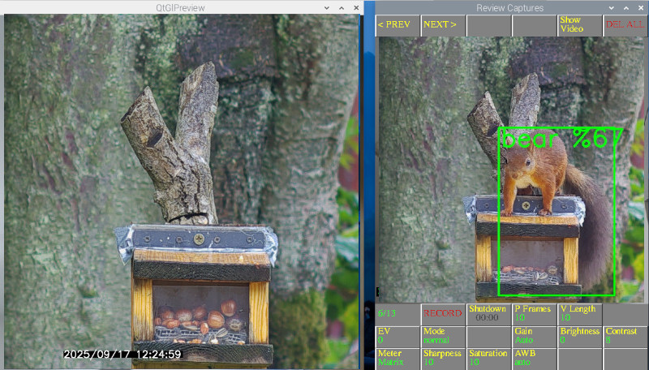

# Pi_Hailo_Wildlife_3

Pi5 + Hailo HAT (8L or 10H) + PI Camera to capture Wildlife videos in MP4 directly.

## Screenshot...(Note there is no red squirrel in the objects list, so it sees them as bears or cats !!)

## My Camera setup... note l have now changed to the Pi 5" Touch2 DSI display...

It is a modified version of the hailo picamera2 detect.py example https://github.com/raspberrypi/picamera2/tree/main/examples/hailo
and https://github.com/raspberrypi/picamera2/blob/main/examples/pyav_circular_capture.py

To setup the hailo..

     sudo apt update && sudo apt full-upgrade -y
     
     sudo reboot

     with Trixie sudo apt install dkms

     with hailo 8L (Ai HAT+) sudo apt install hailo-all

     with hailo 10H (Ai HAT+2) sudo apt install hailo-h10-all

     sudo reboot

     git clone --depth 1 https://github.com/raspberrypi/picamera2

reboot

sudo apt install python3-opencv -y

to autostart at boot if using labwc...

(note: change XXXX to your username)

sudo nano /home/XXXX/.config/labwc/autostart

type in...

/usr/bin/python3 /home/XXXX/detect_003.py

press Ctrl and X, Y, return to save..

Reboot

Captures videos as .mp4 videos

v_width and v_height are set for a Pi GS camera, you may need to change to suit other cameras ....

Runs a pre-capture buffer of approx 5 seconds by default

you can set the objects to detect in line 41, objects = ["cat","bear","bird"], the objects must be in coco.txt file

Copy detect_003.py into /home/USERNAME/picamera2/examples/hailo/

Videos saved in /home/USERNAME/Videos

to run ... 

cd /home/USERNAME/picamera2/examples/hailo/

python3 detect_003.py

When running you will see 2 windows, a live window and a capture review and control window.

right clicking on the 6/13 button (in the image above) will zoom in to help with focussing the camera.

To mask an area of detection right click on the review window. The masking is based on a 16 x 16 grid.
